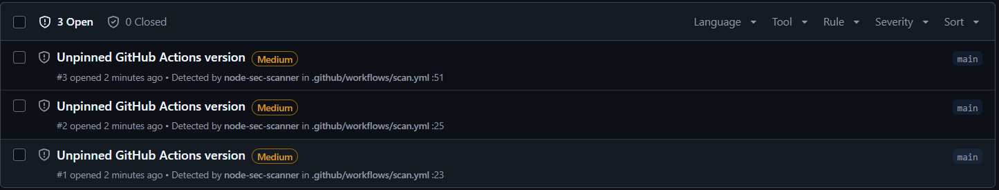

# Findings

Real-world scan results from running node-sec-scanner against public Node.js repositories.

---

## expressjs/express

**Scanned:** 2026-06-02  
**Version:** latest main branch  
**Command:** `npm run dev -- scan ../RandomRepos/express`

### Real Findings

#### qs@6.14.2 — Remote DoS via stringify (GHSA-q8mj-m7cp-5q26)
- **Severity:** Medium
- **File:** `package.json` (transitive dependency via express)
- **CVE:** [GHSA-q8mj-m7cp-5q26](https://osv.dev/vulnerability/GHSA-q8mj-m7cp-5q26)
- **Detail:** `qs.stringify` crashes with a `TypeError` on `null`/`undefined` entries in comma-format arrays when `encodeValuesOnly` is set. Remotely triggerable if user input reaches `qs.stringify` with that option enabled.
- **Remediation:** Upgrade `qs` to a patched version.

---

### False Positives

These findings were raised by the scanner but are not genuine security issues in production code.

#### eval() in test/res.redirect.js:115-116
- **Why false positive:** The word `eval` appears inside a string literal (`var xss = 'javascript:eval(...)'`) used to simulate an XSS payload in a test. The scanner's regex matches the string content — no code is being dynamically evaluated.
- **Root cause:** Regex-based detection cannot distinguish `eval(...)` call expressions from `eval` appearing inside string literals or comments.
- **Planned fix:** Upgrade to AST-based detection via `@typescript-eslint/parser`, which inspects the actual call graph rather than raw text.

#### Hardcoded password in examples/auth/index.js:50
- **Why false positive:** Intentional placeholder credentials in a demo authentication example shipped with the framework. Not production code.
- **Root cause:** Scanner does not exclude `examples/`, `demo/`, or `sample/` directories.
- **Planned fix:** Add configurable path exclusions; auto-exclude common non-production directories (`test/`, `tests/`, `examples/`, `fixtures/`, `__mocks__/`).

#### http:// URL in examples/vhost/index.js:39
- **Why false positive:** Plaintext redirect in a localhost vhost demo. Intentionally uses `http://` for local development.
- **Root cause:** Scanner flags all non-localhost `http://` URLs without considering file context.
- **Planned fix:** Combine path exclusions (above) with a tighter URL rule that skips `example.com` and other documentation-convention domains.

---

## node-sec-scanner (self-scan)

**Scanned:** 2026-06-03
**Version:** main branch
**Command:** `node dist/cli.js scan . --skip-deps --format json`

### Real Findings

#### Unpinned GitHub Actions in .github/workflows/scan.yml

- **Severity:** Medium
- **Rule:** `misconfig.gha-unpinned-action`
- **Findings:**
  - Line 23: `uses: actions/checkout@v4`
  - Line 25: `uses: actions/setup-node@v4`
  - Line 51: `uses: github/codeql-action/upload-sarif@v3`
- **Detail:** All three action references use mutable version tags. A compromised publisher account could move a tag to point to malicious code, which would then run with the permissions granted to the workflow (`contents: read`, `security-events: write`).
- **Remediation:** Pin each action to its full commit SHA. Tags should be left as comments for readability.
- **Status:** Detected by the scanner on the same run that introduced the rule — confirmed dogfood.

---

## Lessons Learned

1. **Regex scanning generates false positives in test and example code.** The highest-value improvement to this scanner is AST-based analysis, which understands whether `eval` is being called or merely referenced in a string.

2. **Dependency scanning is the highest signal-to-noise check.** The `qs` CVE was a genuine finding with zero ambiguity — exact version, confirmed advisory, real dependency. No false positive risk.

3. **Path context matters.** A finding in `src/` carries very different weight than the same finding in `test/` or `examples/`. A future version will annotate findings with a confidence score based on file path.
